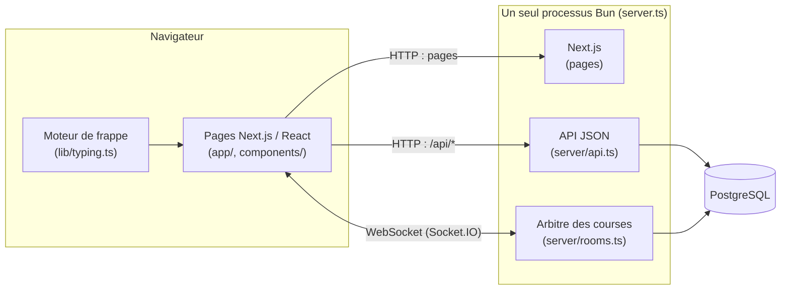
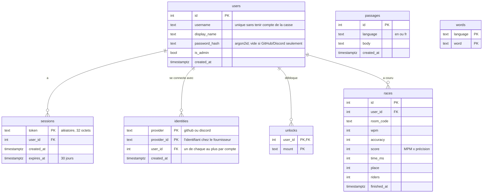
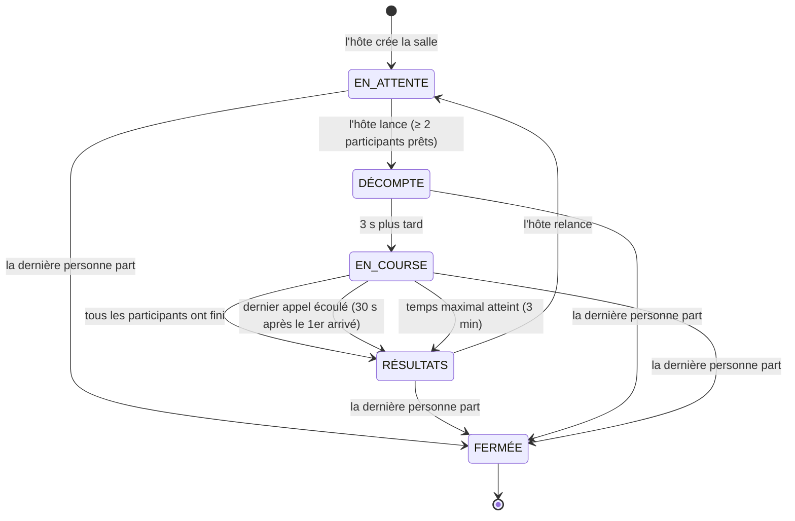
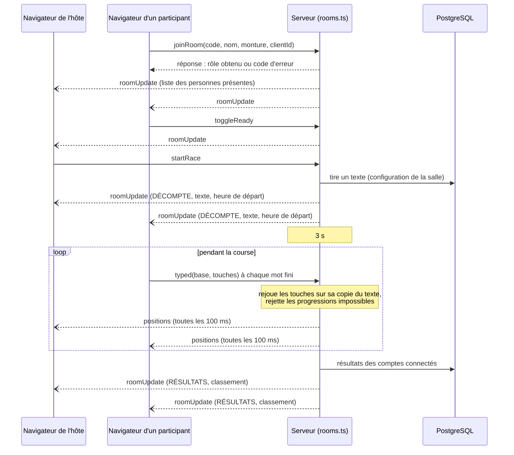

# Architecture

Chocobo Race est une course de frappe multijoueur : tout le monde tape le même
texte, et le chocobo de chaque joueur avance au rythme de sa frappe.

Ce document décrit l'application telle qu'elle est aujourd'hui, et ce qui est
prévu là où c'est indiqué. Il contient :

1. [Vue d'ensemble](#vue-densemble)
2. [Pile technologique](#pile-technologique)
3. [Modèle de données](#modèle-de-données)
4. [Machine à états d'une course (COURSE-01)](#machine-à-états-dune-course-course-01)
5. [Flux des messages temps réel](#flux-des-messages-temps-réel)
6. [ADR-001 : technologie temps réel](#adr-001--technologie-temps-réel)
7. [ADR-002 : gestion des bots](#adr-002--gestion-des-bots)
8. [Sécurité](#sécurité), [langues](#langues-i18n-01), [tests](#tests-et-intégration-continue-tech-09), [installation](#installation)

## Vue d'ensemble



- **Un seul processus** (`server.ts`) sert à la fois les pages Next.js, l'API
  `/api/*` et les WebSockets. C'est pour ça qu'on lance toujours `bun run dev`
  et jamais `next dev`.
- **Le serveur est l'arbitre** (COURSE-06). Le navigateur n'envoie que les
  touches tapées. Positions, précision, ordre d'arrivée, MPM et places sont
  décidés par `server/rooms.ts`.
- Les salles vivent **en mémoire** (une course dure quelques minutes); ce qui
  doit survivre à un redémarrage (comptes, sessions, résultats, textes) est
  dans PostgreSQL.

### Organisation du code

| Dossier / fichier | Rôle |
| --- | --- |
| `server.ts` | Démarre Next.js + Socket.IO sur un seul port; associe la session (cookie) à chaque socket |
| `server/rooms.ts` | L'arbitre : salles, rôles, compte à rebours, positions, arrivée, classement, anti-triche |
| `server/api.ts` | API JSON (`/api/*`) : comptes, textes, statistiques, admin |
| `server/auth.ts`, `server/oauth.ts` | Comptes et sessions (argon2id, jeton aléatoire, cookie HttpOnly); connexion GitHub et Discord |
| `server/db.ts` | Connexion PostgreSQL, création du schéma, remplissage de la banque de textes |
| `server/texts.ts` | Tire un texte de la banque (passages ou mots au hasard) |
| `server/seed/` | Passages et dictionnaires de départ, versés dans la base au premier démarrage |
| `lib/types.ts` | Types partagés serveur/navigateur : salle, joueur, événements Socket.IO, codes d'erreur |
| `lib/rules.ts` | Règles partagées : nombre de joueurs, délais, formule du score |
| `lib/typing.ts` | Règles du moteur de frappe, en fonctions pures (testées) |
| `lib/i18n/` | Dictionnaires français et anglais de l'interface |
| `hooks/` | `useTypingEngine` (état de la frappe), `useRoom` (événements de la salle → état React) |
| `app/`, `components/` | Pages et composants d'interface |
| `tests/` | Tests automatisés |
| `scripts/admin.ts` | Outil en ligne de commande : comptes, montures, banque de textes |

## Pile technologique

| Besoin | Choix | Pourquoi |
| --- | --- | --- |
| Framework web (TECH-01, TECH-02) | Next.js 16 (App Router, React 19), **TypeScript strict** | Exigé. Les types partagés (`lib/types.ts`) font qu'un changement de protocole casse la compilation des deux côtés au lieu de casser en classe. |
| Environnement d'exécution | Bun 1.4 | Exécute TypeScript directement (pas de compilation du serveur), inclut le pilote PostgreSQL, le hachage de mots de passe et le lanceur de tests. |
| Style (TECH-03) | Tailwind CSS v4 | Exigé. Les couleurs restent des variables CSS, ce qui permet de changer de thème en direct (DES-05). |
| Base de données (TECH-04) | PostgreSQL 17 | Exigée. |
| Accès aux données (TECH-04) | `Bun.SQL` aujourd'hui; **ORM avec migrations versionnées à venir** | Voir ci-dessous. |
| Temps réel (TECH-06) | Socket.IO 4 | Voir [ADR-001](#adr-001--technologie-temps-réel). |
| Hébergement (TECH-05) | Render (service web) + Neon (PostgreSQL), forfaits gratuits | Justification dans [deploiement.md](deploiement.md). |
| Tests (TECH-09) | `bun test` + GitHub Actions | Intégré à Bun, aucune dépendance de plus. |

### Accès aux données (TECH-04)

Les requêtes sont aujourd'hui écrites en SQL avec les *tagged templates* de
`Bun.SQL`; chaque `${...}` est envoyé comme paramètre, jamais collé dans la
requête :

```ts
const [row] = await sql`SELECT id FROM users WHERE lower(username) = lower(${username})`;
```

Le schéma est créé au démarrage par `migrate()` (`server/db.ts`), avec des
`CREATE TABLE IF NOT EXISTS` sûrs à relancer. TECH-04 demande un ORM, des
migrations versionnées dans le dépôt et un script de seed (textes,
utilisateurs, historique) : c'est **à faire**. Drizzle est le candidat
pressenti, parce qu'il reste proche du SQL déjà écrit et fonctionne avec Bun.

## Modèle de données



- Un résultat n'est enregistré que pour les **comptes connectés** qui ont
  **fini** la course. Les invités courent normalement, sans historique.
- L'entraînement (`/practice`) n'ouvre aucun socket et n'écrit jamais dans la
  base.
- Comptes, sessions et identités GitHub/Discord sont supprimés en cascade
  avec l'utilisateur.

### Tables prévues pour la remise finale

| Table | Pour | Contenu |
| --- | --- | --- |
| `room_members` | SALLE-06 | Une ligne par personne présente dans une salle, avec une contrainte d'unicité sur la personne : la règle « une seule salle à la fois » est garantie par la base. |
| `invites` | SALLE-04 | Jeton aléatoire (≥ 128 bits), salle, statut, personne et adresse IP liées à la première utilisation, révocation. |
| `bans` | SALLE-07 | Personnes expulsées d'une salle. |
| `race_samples` | RES-05, HIST-02 | Série temporelle du MPM de chaque participant connecté, pour réafficher les graphiques. |
| colonnes de `races` | RES-02 | MPM brut, nombre d'erreurs, statut (terminé, temps écoulé, abandon), bonus reçus, touches manquées. |

## Machine à états d'une course (COURSE-01)

Chaque salle est toujours dans **un seul** de ces états, et seuls les
événements ci-dessous le font changer. C'est le serveur (`server/rooms.ts`)
qui tient l'état : les navigateurs affichent ce qu'il leur envoie
(`roomUpdate`) et ne peuvent pas changer d'état eux-mêmes.

| État dans COURSE-01 | Code (`room.status`) |
| --- | --- |
| EN_ATTENTE | `lobby` |
| DÉCOMPTE | `countdown` |
| EN_COURSE | `racing` |
| RÉSULTATS | `finished` |
| FERMÉE | la salle est retirée de la mémoire |



### Transitions

| De → vers | Déclencheur | Condition vérifiée par le serveur | Ce qui se passe | Code |
| --- | --- | --- | --- | --- |
| *(rien)* → EN_ATTENTE | Un hôte rejoint un code qui n'existe pas | Rôle demandé = hôte (un participant ne peut pas créer de salle) | Salle créée; la langue du texte part de la langue d'interface de l'hôte | `createRoom` |
| EN_ATTENTE → DÉCOMPTE | L'hôte clique « Lancer la course » (`startRace`) | C'est bien l'hôte; salle en attente; au moins 2 participants prêts. Revérifié après le chargement du texte (un double clic ne lance qu'une course) | Un texte est tiré de la banque selon la configuration; seuls les participants **prêts** deviennent partants; départ fixé à maintenant + 3 s | `startRace`, `startCountdown` |
| DÉCOMPTE → EN_COURSE | Minuterie de 3 s (`COUNTDOWN_MS`) | — | Les positions sont diffusées toutes les 100 ms; la minuterie de 3 min démarre | `startRace` |
| EN_COURSE → RÉSULTATS | Le dernier partant franchit la ligne | Tous les partants ont fini (vérifié aussi quand quelqu'un part) | Classement, résultats enregistrés pour les comptes connectés | `endIfEveryoneFinished`, `endRace`, `rankFinishers` |
| EN_COURSE → RÉSULTATS | Dernier appel écoulé | Le premier arrivé a lancé le compte de `FINISH_GRACE_MS` = 30 s | Ceux qui n'ont pas fini n'ont pas de place | `startFinishClock`, `endRace` |
| EN_COURSE → RÉSULTATS | Temps maximal écoulé | `MAX_RACE_MS` = 3 min depuis le départ | Idem | `startRace`, `endRace` |
| RÉSULTATS → EN_ATTENTE | L'hôte clique « Retour au salon » (`playAgain`) | C'est bien l'hôte; salle en résultats | Les joueurs encore déconnectés sont retirés; tout le monde redevient « pas prêt » | `backToLobby` |
| n'importe quel état → FERMÉE | La dernière personne quitte | Plus personne dans la salle | Minuteries arrêtées, salle effacée de la mémoire | `removePlayer` |

### Ce que chaque état permet

| Action | EN_ATTENTE | DÉCOMPTE | EN_COURSE | RÉSULTATS |
| --- | --- | --- | --- | --- |
| Rejoindre la salle | Oui | Oui, comme spectateur jusqu'à la prochaine course | Oui, comme spectateur | Oui, voit les résultats |
| Se déclarer prêt (`toggleReady`) | Oui | Non | Non | Non |
| Changer la configuration (`updateSettings`, hôte) | Oui, diffusée à tous (CONF-12) | Non | Non | Non |
| Envoyer un participant aux estrades (`setWatching`, hôte) | Oui | Non | Non | Non |
| Envoyer ses touches (`typed`) | Ignorées | Ignorées | Jugées par le serveur; acceptées si plausibles (max ~300 MPM) | Ignorées |
| Lancer (`startRace`) / revenir au salon (`playAgain`) | Lancer | — | — | Revenir au salon |
| Un partant se déconnecte | — | Sa voie est gardée 30 s | Sa voie et sa progression sont gardées 30 s (COURSE-08) | Son résultat est gardé jusqu'au retour au salon |

### Minuteries

| Nom (code) | Durée | Rôle |
| --- | --- | --- |
| `COUNTDOWN_MS` | 3 s | Décompte avant le départ (COURSE-03) |
| `FINISH_GRACE_MS` | 30 s | Dernier appel après le premier arrivé |
| `MAX_RACE_MS` | 3 min | Temps maximal d'une course |
| `RECONNECT_MS` | 30 s | Voie gardée pour un participant déconnecté (COURSE-08) |
| `HOST_RECLAIM_MS` | 20 s | Place d'hôte gardée avant de passer à la personne présente depuis le plus longtemps (SALLE-08) |
| `TICK_MS` | 100 ms | Fréquence de diffusion des positions pendant la course (COURSE-05) |

### L'état d'un joueur dans une salle

- **Rôle** : `host` ou `rider`. L'hôte court seulement si `settings.hostRides` est vrai (SALLE-01); il compte alors pour le minimum.
- **`watching`** : participant envoyé aux estrades par l'hôte. Il ne peut pas se déclarer prêt; l'état reste d'une course à l'autre.
- **`ready`** : participant prêt (l'hôte qui court est prêt d'office). Remis à faux au retour au salon.
- **`racing`** : partant de la course en cours, figé au lancement.
- **`finished`**, **`place`**, **`score`** : fixés à l'arrivée; la place n'est donnée qu'à la fin de la course.
- **`away`** : partant déconnecté dont la voie est gardée. Le même onglet (même `clientId`) qui revient reprend sa voie.

### Écarts connus avec le cahier de l'enseignant

La machine actuelle suit le premier cahier des charges. Ces points changent
pour respecter le travail de session; ils sont suivis dans
[EXIGENCES.md](EXIGENCES.md) :

- **SALLE-09** : on ne pourra plus rejoindre pendant DÉCOMPTE et EN_COURSE
  (aujourd'hui, on y entre comme spectateur).
- **COURSE-09** : le dernier appel de 30 s disparaît; la course finit quand
  tous ont fini ou abandonné, ou au temps maximal, réglable par l'hôte
  (CONF-01, aucun ou 30 s à 10 min).
- **COURSE-10** : classement par temps d'arrivée, puis par progression, puis
  les abandons (aujourd'hui, au score MPM × précision).
- **COURSE-11** : l'hôte pourra aussi **fermer** la salle depuis les
  résultats (transition RÉSULTATS → FERMÉE explicite).

## Flux des messages temps réel

### Une course, du lancement aux résultats



### Événements Socket.IO

| Événement | Sens | Contenu |
| --- | --- | --- |
| `joinRoom` | navigateur → serveur | code, nom, monture, rôle voulu, `clientId`, langue d'interface. Réponse : rôle obtenu ou code d'erreur |
| `toggleReady` | navigateur → serveur | — (participant, en attente) |
| `updateSettings` | navigateur → serveur | `{ language?, kind?, hostRides? }` (hôte, en attente) |
| `setWatching` | navigateur → serveur | `(playerId, watching)` : envoie un participant aux estrades ou l'en fait revenir (hôte, en attente) |
| `startRace` | navigateur → serveur | — (hôte). Réponse : `ok` ou code d'erreur |
| `typed` | navigateur → serveur | les touches tapées depuis le dernier envoi (`\b` pour un retour arrière) et le nombre de caractères corrects avant elles; c'est le serveur qui les juge |
| `playAgain` | navigateur → serveur | — (hôte, sur les résultats) |
| `leaveRoom` | navigateur → serveur | — |
| `roomUpdate` | serveur → salle | l'état public complet de la salle |
| `positions` | serveur → salle | toutes les 100 ms pendant la course : `{ id, progress }` par partant |

Charge réseau (PERF-02) : un participant envoie au plus un message par mot
fini, pas un par touche; le serveur regroupe toutes les positions dans un
seul message toutes les 100 ms. Rien n'est écrit dans la base pendant la
course : les résultats le sont une fois, à la fin.

### API HTTP

| Route | Rôle |
| --- | --- |
| `POST /api/auth/signup`, `login`, `logout` | Comptes par nom d'utilisateur et mot de passe; la session est un cookie HttpOnly |
| `GET /api/auth/me` | L'utilisateur connecté (ou `null`) et les fournisseurs proposés |
| `GET /api/auth/github/start`, `…/callback` (idem `discord`) | Connexion OAuth (AUTH-01); connecté, cela lie le compte. Détails dans `server/oauth.ts` |
| `GET /api/text?lang=en\|fr&kind=sentences\|words` | Un texte pour l'entraînement |
| `GET /api/stats/me` | Résumé et 10 dernières courses (connecté) |
| `GET /api/stats/leaderboard` | Meilleurs scores du serveur |
| `GET /api/health` | Vérification de l'hébergeur; ne touche pas la base |
| `POST /api/admin/mount` | Donner ou retirer une monture (admin) |

Le serveur n'envoie jamais de phrases : les erreurs sont des **codes**
(`room-full`, `wrong-credentials`…) que le navigateur traduit (I18N-01).

## ADR-001 : technologie temps réel

**Statut** : accepté (septembre 2026).

### Contexte

La piste doit montrer la progression de tous les participants en direct
(COURSE-05, au moins ~4 mises à jour par seconde), le serveur doit être la
source de vérité (COURSE-06), et une salle compte jusqu'à 30 participants.
Les messages vont dans les deux sens : les touches montent du navigateur, les
positions et l'état de la salle descendent. Tout service externe doit être
gratuit (TECH-08).

Next.js (App Router) ne sait pas garder une connexion WebSocket ouverte dans
ses routes : il faut un serveur à côté, ou un service externe.

### Options considérées

| Option | Pour | Contre |
| --- | --- | --- |
| **Socket.IO** sur le même serveur que Next.js | Salles intégrées (`io.to(code)`), reconnexion automatique, accusés de réception (une action reçoit une réponse), repli sur le *polling* si un réseau bloque les WebSockets, événements typés avec TypeScript | Un serveur personnalisé (`server.ts`) au lieu de `next start`; une dépendance |
| WebSocket brut (`ws` ou `Bun.serve`) | Aucune couche en plus, messages plus légers | Salles, reconnexion, réponses et battements de cœur à réécrire à la main |
| Server-Sent Events + requêtes HTTP | Pas de serveur personnalisé | Un sens seulement : chaque frappe devient une requête HTTP; état partagé entre requêtes à gérer |
| Service hébergé (Pusher, Ably, Supabase Realtime) | Rien à héberger pour le temps réel | Le serveur n'est plus au milieu des messages (difficile d'être autoritaire), limites des forfaits gratuits, un service de plus à configurer pour corriger |
| MQTT | Léger, modèle publication/abonnement | Il faut un courtier (broker) en plus, et un pont WebSocket pour le navigateur |

### Décision

**Socket.IO**, dans le même processus Bun que Next.js (`server.ts`).
L'arbitre (`server/rooms.ts`) garde l'état de chaque salle en mémoire et est
le seul à le modifier.

### Conséquences

- On lance l'application avec `bun run dev` / `bun run start` (le serveur
  personnalisé), jamais `next dev` / `next start`.
- **Une seule instance** : l'état des salles est en mémoire, donc on ne peut
  pas répartir la charge sur plusieurs serveurs sans ajouter Redis
  (adaptateur Socket.IO). C'est suffisant pour une classe. Ça exclut aussi
  les hébergeurs « serverless » comme Vercel, où les instances ne partagent
  rien et les connexions sont coupées après quelques minutes.
- Un redémarrage du serveur interrompt les courses en cours.
- Le protocole est typé une fois (`lib/types.ts`) et vérifié par le
  compilateur des deux côtés. La validation des messages par un schéma
  (TECH-07) reste à ajouter.

## ADR-002 : gestion des bots

**Statut** : proposé; rien n'est encore implanté. Cette section décrit
l'approche prévue (BOT-01 à BOT-05).

### Contexte

Des bots de cinq niveaux complètent les salles (CONF-10), comptent pour le
minimum de 2 participants (COURSE-02), subissent les bonus et malus comme les
humains (BOT-04), varient leur vitesse (BOT-02), font des erreurs qu'ils
corrigent selon le mode d'erreur (BOT-03), et doivent être testables à
partir d'une graine (BOT-05).

### Décision

**Les bots tournent sur le serveur, dans l'arbitre, et passent par le même
chemin que les humains.**

1. **Un bot est un participant** de la salle, avec un indicateur `bot: true`
   et un niveau. Il n'a pas de socket. Il est affiché comme bot sur la piste
   et dans les résultats (BOT-04), et il compte dans la capacité.
2. **Un moteur pur** (`lib/bots.ts`) calcule, à partir d'une graine, du texte,
   du niveau et du mode d'erreur, la liste des touches que le bot va taper et
   le moment de chacune : `planBot(seed, text, level, errorMode)` →
   `[{ atMs, key }]`. Aucun `Math.random` : un générateur pseudo-aléatoire à
   graine (par exemple *mulberry32*), donc le même appel donne toujours le
   même résultat, ce qui se teste unitairement (BOT-05).
3. **L'arbitre rejoue ce plan** au fil de la course et fait passer les
   touches du bot par la même fonction que celles d'un humain
   (`replayKeys`). Progression, précision, MPM, classement et bonus sont donc
   calculés exactement de la même façon pour tous.
4. **Le plan est recalculé quand le texte change** (bonus « +3 mots »,
   « -3 mots », BONUS-04) à partir de la position actuelle et d'une graine
   dérivée.

### Le modèle de frappe

| Niveau | MPM visé | Taux d'erreur |
| --- | --- | --- |
| Noob | 10–20 | ~12 % |
| Débutant | 20–35 | ~8 % |
| Intermédiaire | 35–60 | ~5 % |
| Expert | 70–100 | ~2 % |
| Impossible | 140+ | ~0,5 % |

- **Vitesse de base** : un MPM tiré dans la plage du niveau au début de la
  course, converti en délai moyen par caractère (60 000 ms ÷ (MPM × 5)).
- **Variation** (BOT-02) : un bruit sur chaque délai, des « rafales » (plusieurs
  caractères plus rapides) et des **hésitations** plus longues avant les mots
  difficiles (longs, avec majuscules, accents, chiffres ou ponctuation).
- **Erreurs** (BOT-03) : selon le taux du niveau, le bot tape une touche
  voisine sur le clavier. En **correction obligatoire**, il s'en rend compte
  après 0 à 2 caractères, attend un court temps de réaction, efface avec des
  retours arrière et retape. En **mode libre**, il continue et l'erreur est
  comptée.
- Les valeurs exactes seront documentées dans [EXIGENCES.md](EXIGENCES.md)
  une fois ajustées.

### Conséquences

- Pas de trafic réseau pour les bots, et l'anti-triche du serveur les juge
  comme tout le monde (le niveau « Impossible », à 140+ MPM, reste sous la
  limite de ~300 MPM).
- Les tests de `lib/bots.ts` vérifient, pour une graine fixe : le MPM obtenu
  dans la plage du niveau, un taux d'erreur proche de celui visé, des délais
  qui varient, et le respect du mode d'erreur.
- Les résultats des bots ne sont pas enregistrés dans la base.

## Sécurité

- **Mots de passe** hachés avec argon2id (`Bun.password`), jamais stockés ni
  journalisés en clair (SEC-03). Une connexion avec un compte inexistant
  prend le même temps qu'un mauvais mot de passe.
- **Session** : jeton aléatoire dans un cookie `HttpOnly`, `SameSite=Lax`, et
  `Secure` en production.
- **OAuth** : un paramètre `state` aléatoire, gardé dans un cookie, est
  vérifié au retour; les comptes sont liés par l'identifiant du fournisseur,
  jamais par le nom affiché.
- **SQL** toujours paramétré.
- **Le serveur décide** : le navigateur envoie les touches tapées, jamais un
  verdict. Le serveur les rejoue avec les mêmes règles (`replayKeys` dans
  `lib/typing.ts`) sur sa propre copie du texte. Une page modifiée pour
  compter chaque touche comme bonne n'avance donc pas. Une progression plus
  rapide qu'un humain est ignorée. Les actions de l'hôte (lancer, configurer,
  envoyer aux estrades) sont vérifiées côté serveur (SEC-01).
- **Limite connue** : un script qui envoie les *bonnes* touches à la place
  du joueur reste possible, comme sur tout jeu de frappe en ligne; seule la
  limite de vitesse (~300 MPM) le borne.

## Langues (I18N-01)

Chaque mot de l'interface est dans `lib/i18n/en.ts` et `lib/i18n/fr.ts`. Le
dictionnaire français est typé avec la forme de l'anglais : une traduction
manquante est une erreur de compilation. La langue de départ est choisie par
le serveur (cookie, sinon langue du navigateur). La langue du **texte à
taper** est un réglage séparé de la salle (CONF-02).

## Tests et intégration continue (TECH-09)

`bun test` lance 68 tests : règles du moteur de frappe, score et
dictionnaires, arbitre avec de vrais clients Socket.IO, et API HTTP. GitHub
Actions (`.github/workflows/ci.yml`) vérifie le lint, les types
(`tsc --noEmit`), les tests (avec une vraie base PostgreSQL) et le build à
chaque envoi.

## Installation

```bash
bun install
createdb chocobo_race          # PostgreSQL doit tourner
cp .env.example .env           # puis y mettre DATABASE_URL
bun run dev                    # http://localhost:3000
bun test                       # les tests (utilisent aussi la base)
```

## Limites connues

- Hébergement gratuit : le serveur s'endort après 15 minutes sans visite (voir [deploiement.md](deploiement.md)).
- L'état des salles est en mémoire : un redémarrage du serveur interrompt les
  courses en cours (voir [ADR-001](#adr-001--technologie-temps-réel)).
