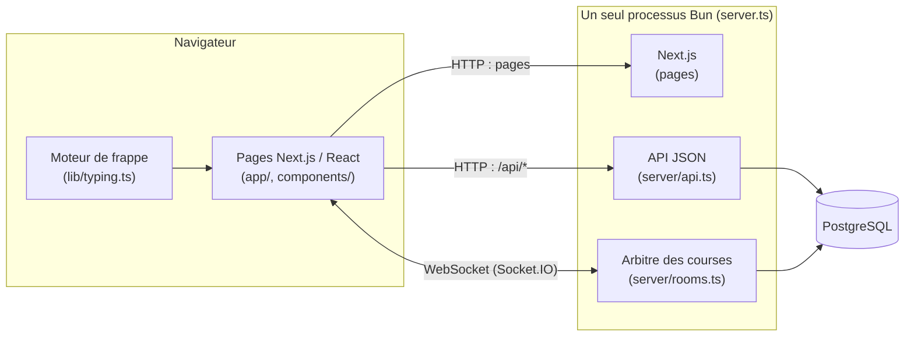
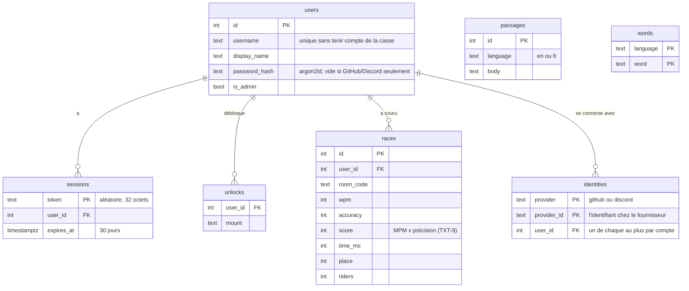

# Documentation technique (TECH-8)

Chocobo Race est une course de frappe multijoueur : tout le monde tape le même
texte, et le chocobo de chaque joueur avance au rythme de sa frappe.

## Vue d'ensemble



- **Un seul processus** (`server.ts`) sert à la fois les pages Next.js, l'API
  `/api/*` et les WebSockets. C'est pour ça qu'on lance toujours `bun run dev`
  et jamais `next dev`.
- **Le serveur est l'arbitre.** Le navigateur n'envoie que « j'ai tapé N
  caractères corrects ». Positions, ordre d'arrivée, MPM, score et places sont
  décidés par `server/rooms.ts`. Voir [la machine à états](machine-a-etats.md).
- Les salons vivent **en mémoire** (une course dure quelques minutes); ce qui
  doit survivre à un redémarrage (comptes, sessions, résultats, textes) est
  dans PostgreSQL.

## Pile technologique et justification des choix

| Besoin | Choix | Pourquoi |
| --- | --- | --- |
| Framework web (TECH-1) | Next.js 16 (React 19), **TypeScript strict** | Exigé. Le mode strict et les types partagés (`lib/types.ts`) font qu'un changement de protocole casse la compilation des deux côtés au lieu de casser en classe. |
| Environnement d'exécution | Bun 1.4 | Contrainte du projet. Exécute TypeScript directement (pas de compilation du serveur), inclut le pilote PostgreSQL, le hachage de mots de passe et le lanceur de tests. |
| Style (TECH-2) | Tailwind CSS v4 | Exigé. Les couleurs restent des variables CSS, ce qui permet de changer de thème en direct (UX-3). |
| Base de données (TECH-3) | PostgreSQL 17 | Exigée. |
| Accès aux données (TECH-3) | **`Bun.SQL`, sans ORM** | Voir ci-dessous. |
| Temps réel (TECH-4) | Socket.IO 4 | Salons (`io.to(code)`), reconnexion automatique, accusés de réception pour les réponses, repli sur le *polling* si un réseau bloque les WebSockets. |
| Tests (TECH-7) | `bun test` + GitHub Actions | Intégré à Bun, aucune dépendance de plus. |

### Pourquoi `Bun.SQL` plutôt qu'un ORM (TECH-3)

Les requêtes sont écrites en SQL avec des *tagged templates* :

```ts
const [row] = await sql`SELECT id FROM users WHERE lower(username) = lower(${username})`;
```

- **Sûr contre l'injection SQL** : chaque `${...}` est envoyé comme
  paramètre, jamais collé dans la requête.
- **Aucune dépendance** : le pilote est fourni par Bun. Pas de génération de
  code ni d'étape de migration séparée.
- **Petit schéma** : 6 tables et une vingtaine de requêtes. Un ORM (Prisma,
  Drizzle) ajouterait un langage de schéma, une génération de client et un
  outil de migration pour peu de gain.
- **Lisible pour apprendre** : le SQL exécuté est exactement celui qu'on lit.

**Contreparties acceptées** : les lignes renvoyées ne sont pas typées
automatiquement (on annote le type à la main, par exemple
`const rows: RecentRace[] = await sql...`), et le schéma est créé par
`migrate()` (`server/db.ts`) avec des `CREATE TABLE IF NOT EXISTS` sûrs à
relancer à chaque démarrage, plutôt que par un historique de migrations. Si le
schéma grossissait beaucoup, Drizzle serait le premier candidat (proche du SQL,
compatible Bun).

## Organisation du code

| Dossier / fichier | Rôle |
| --- | --- |
| `server.ts` | Démarre Next.js + Socket.IO sur un seul port; associe la session (cookie) à chaque socket |
| `server/rooms.ts` | L'arbitre : salons, rôles, compte à rebours, positions, arrivée, classement, anti-triche |
| `server/api.ts` | API JSON (`/api/*`) : comptes, textes, statistiques, admin |
| `server/auth.ts` | Comptes et sessions (argon2id, jeton aléatoire, cookie HttpOnly) |
| `server/db.ts` | Connexion PostgreSQL, création du schéma, remplissage de la banque de textes |
| `server/texts.ts` | Tire un texte de la banque (phrases ou mots au hasard) (TXT-3) |
| `server/seed/` | Textes et dictionnaires de départ, versés dans la base au premier démarrage |
| `lib/types.ts` | Types partagés serveur/navigateur : salon, joueur, événements Socket.IO, codes d'erreur |
| `lib/rules.ts` | Règles partagées : 2 à 40 cavaliers, délais, formule du score |
| `lib/typing.ts` | Règles du moteur de frappe, en fonctions pures (testées) |
| `lib/i18n/` | Dictionnaires français et anglais de l'interface (UX-5) |
| `hooks/` | `useTypingEngine` (état de la frappe), `useRoom` (événements du salon → état React) |
| `app/`, `components/` | Pages et composants d'interface |
| `tests/` | Tests automatisés |
| `scripts/admin.ts` | Outil en ligne de commande : comptes, montures, banque de textes |

## Modèle de données



- Un résultat n'est enregistré que pour les **comptes connectés** qui ont
  **fini** la course. Les invités courent normalement, sans historique.
- L'entraînement (`/practice`) n'ouvre aucun socket et n'écrit jamais dans la
  base.

## Protocole

### Événements Socket.IO

| Événement | Sens | Contenu |
| --- | --- | --- |
| `joinRoom` | navigateur → serveur | code, nom, monture, rôle voulu, `clientId`, langue d'interface. Réponse : rôle obtenu ou code d'erreur |
| `toggleReady` | navigateur → serveur | — (cavalier, dans le salon) |
| `updateSettings` | navigateur → serveur | `{ language?, kind? }` (hôte, dans le salon) |
| `startRace` | navigateur → serveur | — (hôte). Réponse : `ok` ou code d'erreur |
| `typed` | navigateur → serveur | les touches tapées depuis le dernier envoi (`\b` pour un retour arrière) et le nombre de caractères corrects avant elles; c'est le serveur qui les juge |
| `playAgain` | navigateur → serveur | — (hôte, après la course) |
| `leaveRoom` | navigateur → serveur | — |
| `roomUpdate` | serveur → salon | l'état public complet du salon |
| `positions` | serveur → salon | toutes les 100 ms pendant la course : `{ id, progress }` par partant |

### API HTTP

| Route | Rôle |
| --- | --- |
| `POST /api/auth/signup`, `login`, `logout` | Comptes; la session est un cookie HttpOnly |
| `GET /api/auth/me` | L'utilisateur connecté (ou `null`) et les fournisseurs proposés |
| `GET /api/auth/github/start`, `…/callback` (idem `discord`) | Connexion OAuth (AUTH-1, AUTH-2); connecté, cela lie le compte (AUTH-3). Détails dans `server/oauth.ts` |
| `GET /api/text?lang=en\|fr&kind=sentences\|words` | Un texte pour l'entraînement |
| `GET /api/stats/me` | Résumé et 10 dernières courses (connecté) |
| `GET /api/stats/leaderboard` | Meilleurs scores du serveur |
| `POST /api/admin/mount` | Donner ou retirer une monture (admin) |

Le serveur n'envoie jamais de phrases : les erreurs sont des **codes**
(`room-full`, `wrong-credentials`…) que le navigateur traduit (UX-5).

## Sécurité

- **Mots de passe** hachés avec argon2id (`Bun.password`), jamais stockés en
  clair. Une connexion avec un compte inexistant prend le même temps qu'un
  mauvais mot de passe.
- **Session** : jeton aléatoire dans un cookie `HttpOnly` et `SameSite=Lax`;
  un script de la page ne peut pas le lire.
- **SQL** toujours paramétré (voir TECH-3).
- **Le serveur décide** : le navigateur envoie les touches tapées, jamais un
  verdict. Le serveur les rejoue avec les mêmes règles (`replayKeys` dans
  `lib/typing.ts`) sur sa propre copie du texte et en tire la progression et
  la précision. Une page dont le code a été modifié pour compter chaque
  touche comme bonne n'avance donc pas. Progression plus rapide qu'un humain
  ignorée, montures verrouillées vérifiées côté serveur.
- **Limite connue** : un script qui envoie les *bonnes* touches à la place
  du joueur (un robot) reste possible, comme sur tout jeu de frappe en
  ligne; seule la limite de vitesse (~300 MPM) le borne.

## Langues (UX-5)

Chaque mot de l'interface est dans `lib/i18n/en.ts` et `lib/i18n/fr.ts`. Le
dictionnaire français est typé avec la forme de l'anglais : une traduction
manquante est une erreur de compilation. La langue de départ est choisie par
le serveur (cookie, sinon langue du navigateur). La langue du **texte à taper**
est un réglage séparé (TXT-7).

## Tests et intégration continue (TECH-7)

`bun test` lance 65 tests : règles du moteur de frappe, score et
dictionnaires, arbitre avec de vrais clients Socket.IO, et API HTTP. GitHub
Actions (`.github/workflows/ci.yml`) vérifie le lint, les types, les tests
(avec une vraie base PostgreSQL) et le build à chaque envoi.

## Installation

```bash
bun install
createdb chocobo_race          # PostgreSQL doit tourner
cp .env.example .env           # puis y mettre DATABASE_URL
bun run dev                    # http://localhost:3000
bun test                       # les tests (utilisent aussi la base)
```

## Limites connues

- Hébergement gratuit : le serveur s'endort après 15 minutes sans visite (voir [deploiement.md](deploiement.md)).
- Un robot qui envoie les bonnes touches n'est limité que par la vitesse maximale (voir Sécurité).
- Un hôte ne tape jamais; il ne peut pas choisir de jouer (COURSE-5).
- L'état des salons est en mémoire : un redémarrage du serveur interrompt les
  courses en cours.

Le [guide de déploiement](deploiement.md) justifie le choix de l'hébergeur
(TECH-6). La [matrice des exigences](matrice-des-exigences.md) donne l'état de chaque
exigence du cahier des charges.
