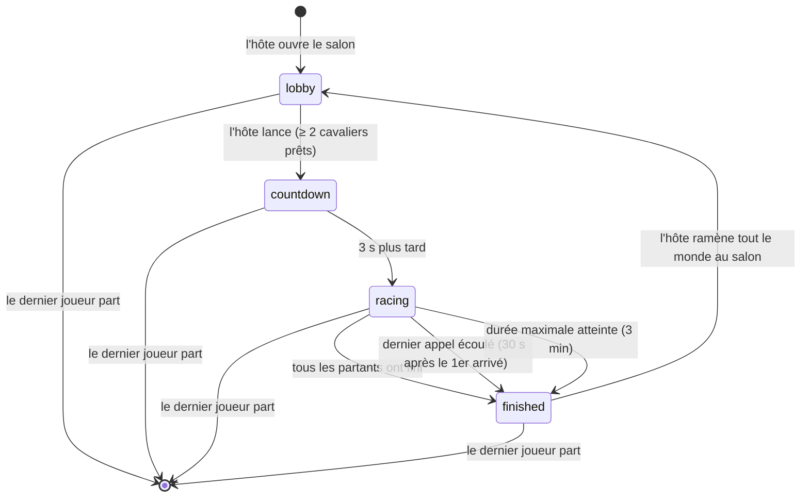

# Machine à états d'une course (TECH-5)

Chaque salon est toujours dans **un seul** de ces quatre états, et seuls les
événements ci-dessous le font changer. C'est le serveur (`server/rooms.ts`) qui
tient l'état : les navigateurs ne font qu'afficher ce qu'il leur envoie
(`roomUpdate`), ils ne peuvent pas changer d'état eux-mêmes.

| État (code) | Nom dans le cahier des charges |
| --- | --- |
| `lobby` | attente |
| `countdown` | compte à rebours |
| `racing` | en cours |
| `finished` | terminée |

## Diagramme

## Transitions

| De → vers | Déclencheur | Condition vérifiée par le serveur | Ce qui se passe | Code |
| --- | --- | --- | --- | --- |
| *(rien)* → `lobby` | Un hôte rejoint un code qui n'existe pas | Rôle demandé = hôte (un cavalier ne peut pas créer de salon) | Salon créé. La langue du texte part de la langue d'interface de l'hôte | `createRoom` |
| `lobby` → `countdown` | L'hôte clique « Lancer la course » (`startRace`) | C'est bien l'hôte; salon en `lobby`; au moins `MIN_RIDERS` = 2 cavaliers prêts. Revérifié après le chargement du texte (un double clic ne lance qu'une course) | Un texte est tiré de la banque selon les réglages; seuls les cavaliers **prêts** deviennent partants (`racing`); départ fixé à maintenant + 3 s | `startRace` (handler), `startCountdown` |
| `countdown` → `racing` | Minuterie de 3 s (`COUNTDOWN_MS`) | — | Les positions sont diffusées toutes les 100 ms; la minuterie de 3 min démarre | `startRace` |
| `racing` → `finished` | Le dernier partant franchit la ligne | Tous les partants ont fini (vérifié aussi quand un joueur part) | Places attribuées **au score** (MPM × précision), résultats enregistrés pour les comptes connectés | `endIfEveryoneFinished`, `endRace`, `rankFinishers` |
| `racing` → `finished` | Dernier appel écoulé | Le premier arrivé a lancé le compte de `FINISH_GRACE_MS` = 30 s | Ceux qui n'ont pas fini sont « abandon » (pas de place) | `startFinishClock`, `endRace` |
| `racing` → `finished` | Durée maximale écoulée | `MAX_RACE_MS` = 3 min depuis le départ | Idem | `startRace`, `endRace` |
| `finished` → `lobby` | L'hôte clique « Retour au salon » (`playAgain`) | C'est bien l'hôte; salon en `finished` | Les joueurs encore déconnectés sont retirés; tout le monde redevient « pas prêt » | `backToLobby` |
| n'importe quel état → *(supprimé)* | Le dernier joueur quitte | Plus personne dans le salon | Minuteries arrêtées, salon effacé de la mémoire | `removePlayer` |

## Ce que chaque état permet

| Action | `lobby` | `countdown` | `racing` | `finished` |
| --- | --- | --- | --- | --- |
| Rejoindre le salon | Oui (cavalier ou hôte) | Oui, comme **spectateur** jusqu'à la prochaine course (COURSE-7) | Oui, comme **spectateur** (COURSE-7) | Oui, voit les résultats |
| Se déclarer prêt (`toggleReady`) | Oui | Non | Non | Non |
| Changer les réglages (`updateSettings`, hôte) | Oui, diffusés à tous (COURSE-11) | Non | Non | Non |
| Envoyer sa progression (`progress`) | Ignorée | Ignorée | Acceptée si plausible (anti-triche : max ~300 MPM) | Seulement pour renvoyer une précision perdue |
| Lancer (`startRace`) / revenir au salon (`playAgain`) | Lancer | — | — | Revenir au salon |
| Un partant se déconnecte | — | Sa voie est gardée 30 s (COURSE-14) | Sa voie et sa progression sont gardées 30 s (COURSE-14) | Son résultat est gardé jusqu'au retour au salon |

## Minuteries

| Nom (code) | Durée | Rôle |
| --- | --- | --- |
| `COUNTDOWN_MS` | 3 s | Compte à rebours avant le départ (COURSE-8) |
| `FINISH_GRACE_MS` | 30 s | Dernier appel après le premier arrivé (COURSE-15, H-3) |
| `MAX_RACE_MS` | 3 min | Durée maximale d'une course (COURSE-9) |
| `RECONNECT_MS` | 30 s | Voie gardée pour un cavalier déconnecté (COURSE-14) |
| `HOST_RECLAIM_MS` | 20 s | Place d'hôte gardée avant de passer au joueur le plus ancien |
| `TICK_MS` | 100 ms | Fréquence de diffusion des positions pendant la course (AFF-1) |

## L'état d'un joueur à l'intérieur d'une course

L'état du salon ne dit pas tout : chaque joueur a aussi quelques indicateurs.

- **Rôle** : `host` (ne tape jamais) ou `rider`.
- **`ready`** : cavalier prêt dans le salon. Remis à faux au retour au salon.
- **`racing`** : partant de la course en cours. Figé au lancement : quelqu'un qui arrive après regarde.
- **`finished`**, **`place`**, **`score`** : fixés à l'arrivée; la place n'est donnée qu'à la fin de la course, par score.
- **`away`** : partant déconnecté dont la voie est gardée. Le même onglet (même `clientId`) qui revient reprend sa voie.

## Comment c'est vérifié

Les tests automatisés de `tests/rooms.test.ts` jouent ces transitions avec de
vrais clients Socket.IO : lancement refusé à 1 cavalier prêt, double clic,
compte à rebours puis course, arrivée en retard, déconnexion et retour,
dernier appel, classement au score et retour au salon. Ils tournent à chaque
envoi sur GitHub (voir `.github/workflows/ci.yml`).
